# linux-demo
demo project

# Level 1 – Basic (Foundational Skills)

- Set up users, groups for devops team

```bash
sudo useradd rakesh23
sudo passwd rakesh23
sudo groupadd devopsteam
sudo usermod -aG devopsteam rakesh23
```
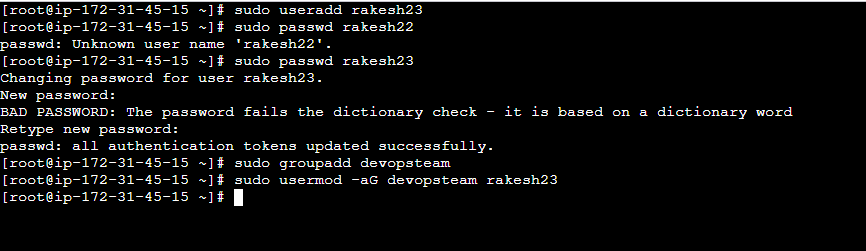

- Manage permissions for project directories

``` bash
sudo mkdir /opt/linux-projectA
sudo chown root:devopsteam /opt/linux-projectA
sudo chmod 770 /opt/linux-projectA
```
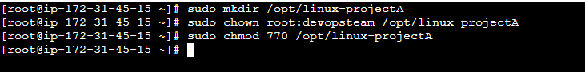

- Install required packages (Git, Nginx, Java)

``` bash
sudo yum install git  -y
sudo yum install nginx -y 
sudo yum install java-17 -y

sudo systemctl enable --now nginx
```


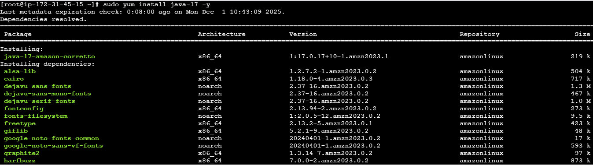


- Check system info (Memory, CPU, Disks)

``` bash
free -h
top
lsblk
df -h
uname -a
htop
```
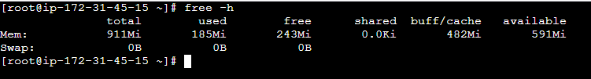

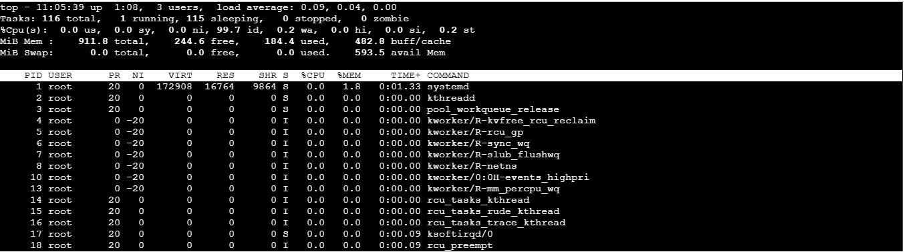

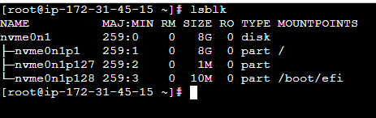

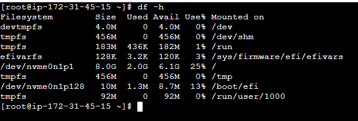

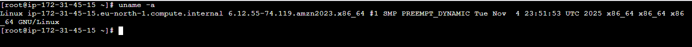

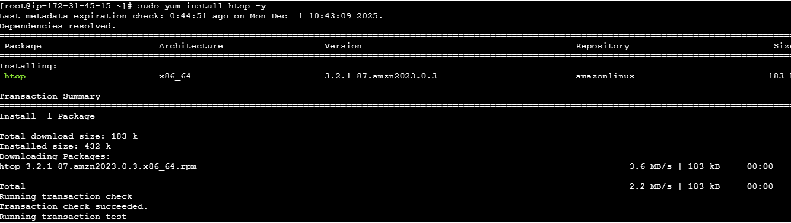

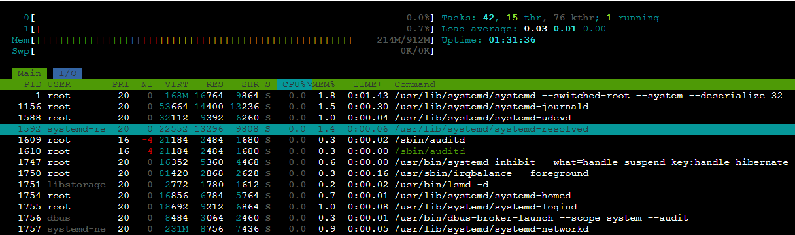

## Level 2 – Intermediate (Daily DevOps Tasks)

- Automate backups with Cron

``` bash
crontab -e
0 2 * * * tar -czf /backup/html-$(date +\%F).tar.gz /var/www/html
```
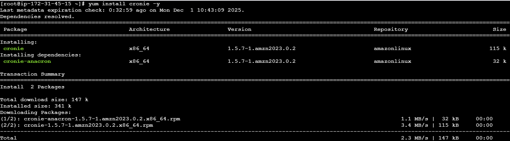

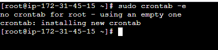


- Create shell scripts: Log cleanup

``` bash 
#!/bin/bash
find /var/log -type f -mtime +7 -delete
```
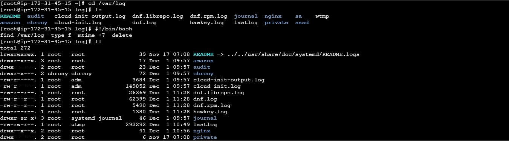

service restart

``` bash 
#!/bin/bash
systemctl restart nginx
```


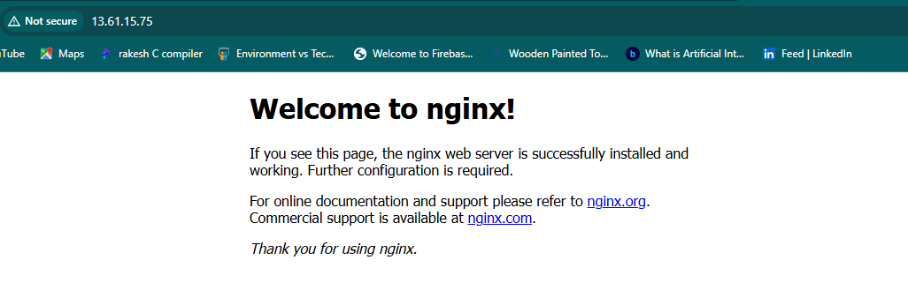

 health checks

```bash
#!/bin/bash
curl -I http://localhost | grep "200 OK"
```
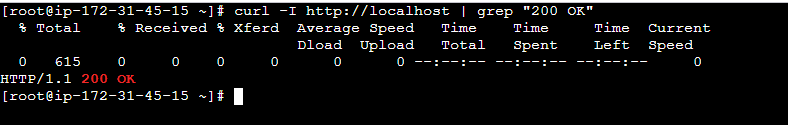

- Manage logs under /var/log

``` bash
cd /var/log
tail -f messages
tail -f secure
journalctl -u nginx
```
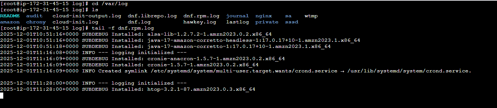

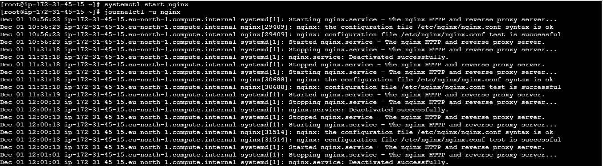

- Monitor system performance and troubleshoot services

``` bash 
top
vmstat 1
iostat
systemctl status nginx
journalctl -xe
```
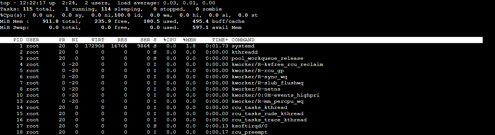

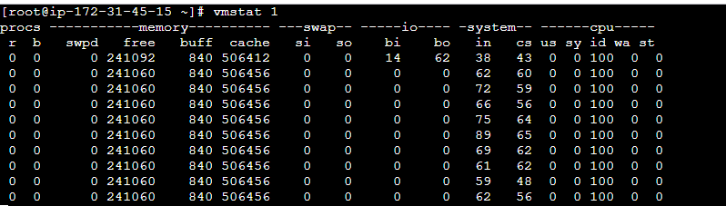

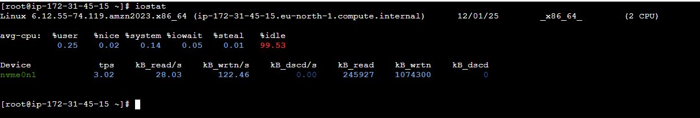

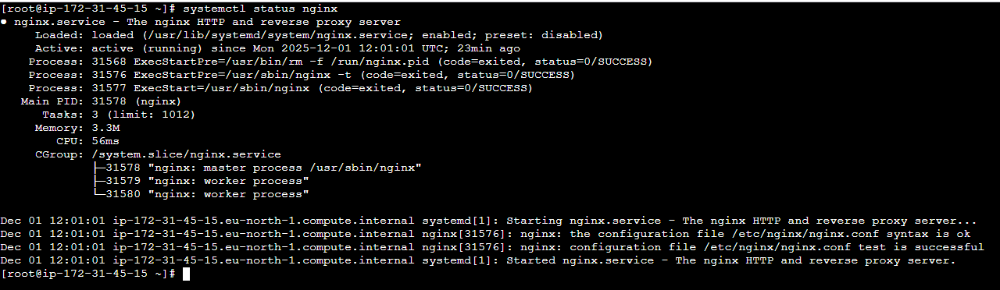


## Level 3 – Advanced (Production-Ready Linux Admin)

- Create custom systemd service for your application

``` bash 
[Unit]
Description=My Node App
After=network.target

[Service]
ExecStart=/usr/bin/node /opt/app/server.js
Restart=always
User=ec2-user

[Install]
WantedBy=multi-user.target
#### Enable it:

sudo systemctl daemon-reload
sudo systemctl enable --now myapp
```
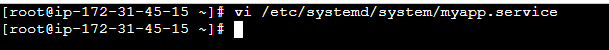

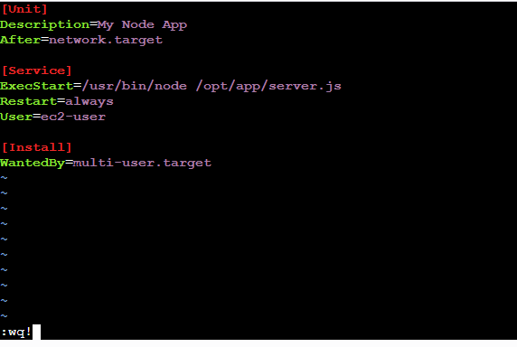

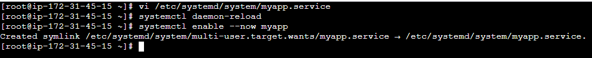

- SSH hardening for security

``` bash 
PermitRootLogin no
PasswordAuthentication no
AllowUsers rakesh23
Then :
sudo systemctl restart sshd
```
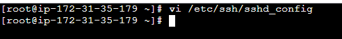

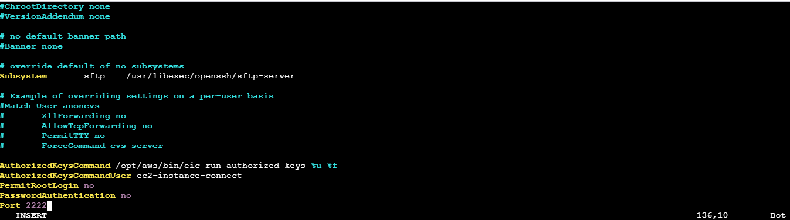

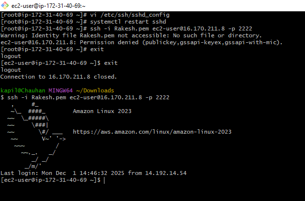

- LVM setup for storage scaling

``` bash
pvcreate /dev/xvdb
vgcreate appvg /dev/xvdb
lvcreate -L 10G -n applv appvg
mkfs.xfs /dev/appvg/applv
mount /dev/appvg/applv /opt/app
```
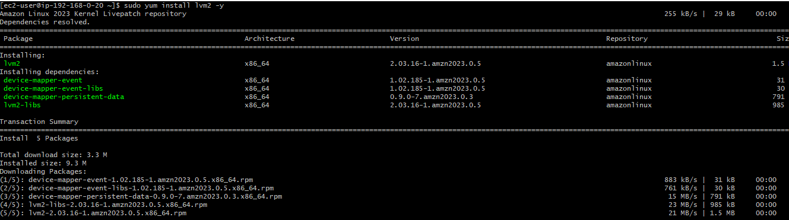

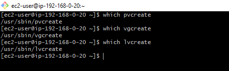

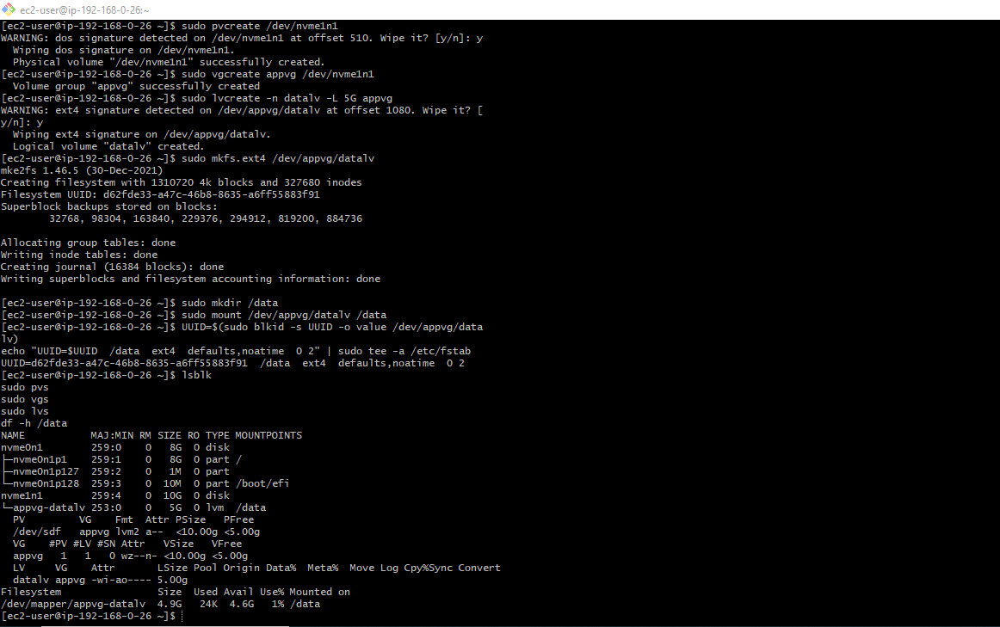

- Configure firewall rules

``` bash
For Firewalld:
sudo firewall-cmd --add-port=80/tcp --permanent
sudo firewall-cmd --reload
For UFW:
sudo ufw allow 80/tcp
sudo ufw enable
```


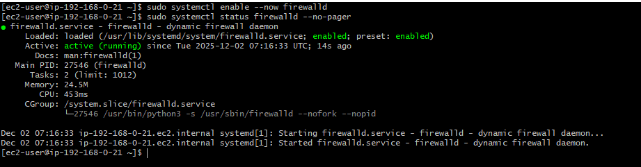

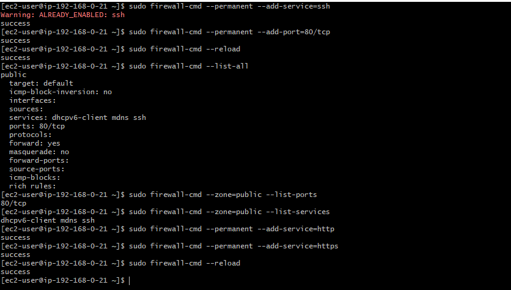

- Implement logrotate for app logs

``` bash
/var/log/myapp/*.log {
    daily
    rotate 7
    compress
    missingok
    notifempty
}
```
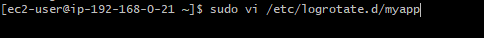

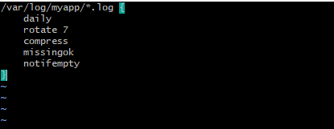

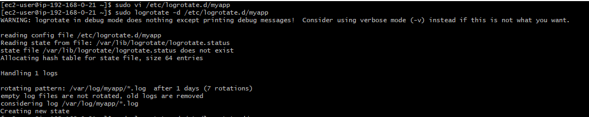